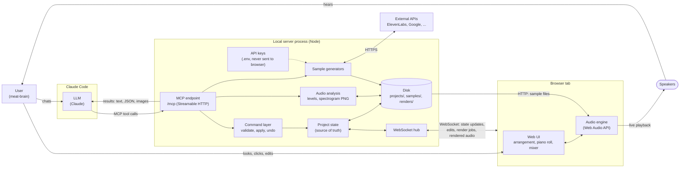
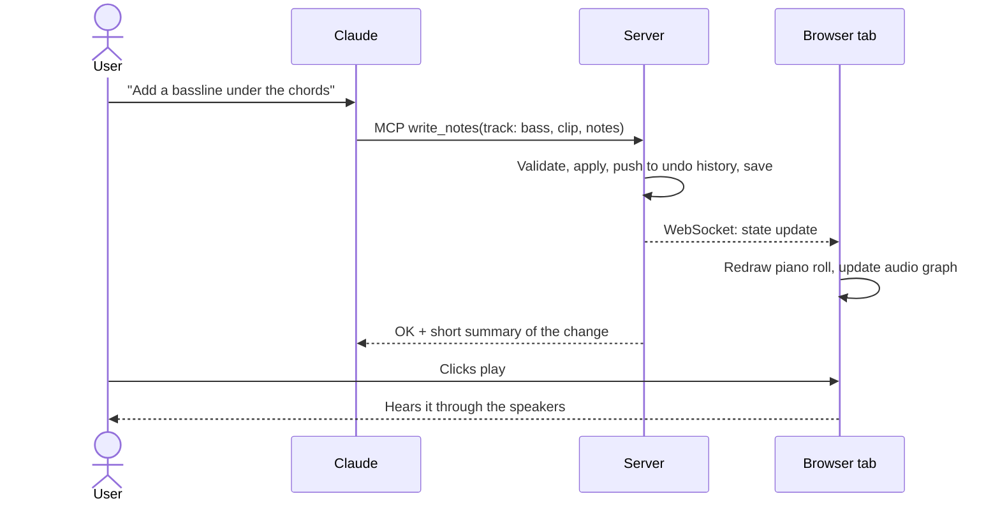
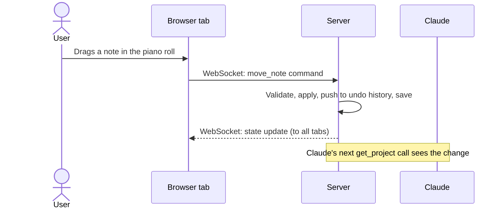
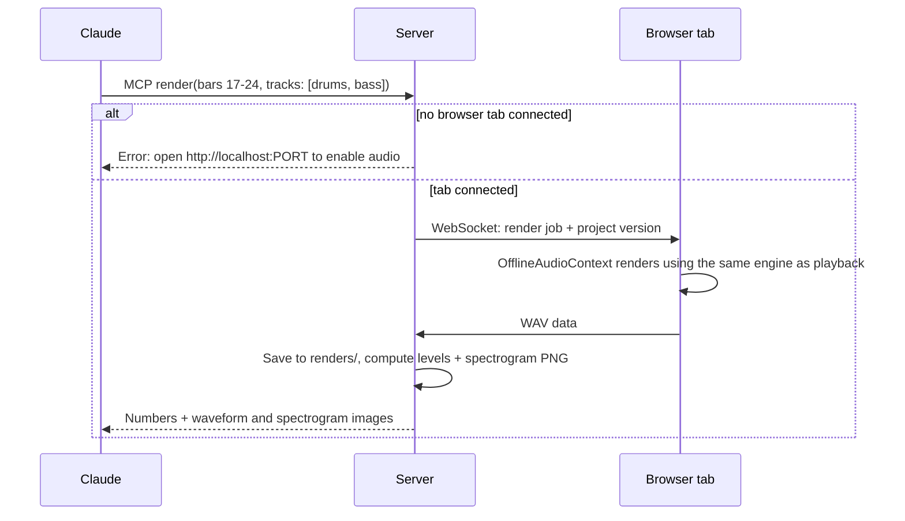
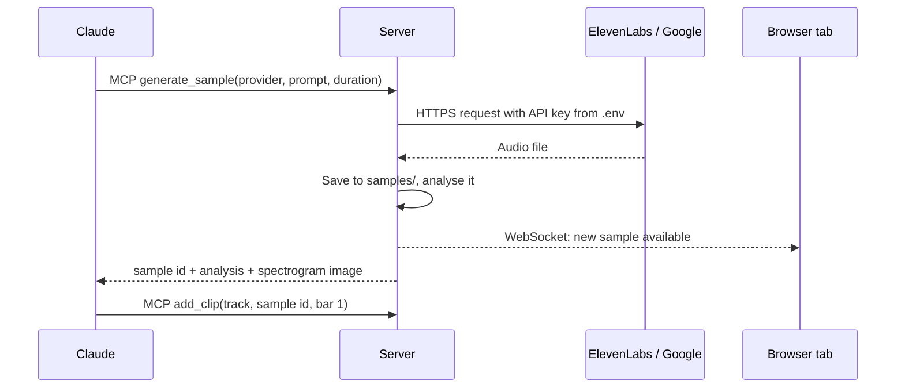

# Auto DAW — System Architecture

An **MCP-first** digital audio workstation. An LLM agent (e.g. Claude in Claude Code) is the primary way of driving it; a web UI lets a human watch, listen, and tweak along the way. Everything runs locally: `git clone` → `npm install` → `npm run dev`.

## The four parties

| Party | What it is | What it does |
|---|---|---|
| **User** | You, a meat-brain | Chats with the LLM, watches and listens in the browser, makes edits by hand |
| **LLM** | Claude, via Claude Code (or any MCP client) | Edits the project, and asks for renders so it can "hear" the result as data and images |
| **Server** | A local Node process started by `npm run dev` | Holds the project state and API keys, serves the MCP endpoint and the UI, stores files |
| **Web UI** | A browser tab at `http://localhost:PORT` | Shows the project, **and is the audio engine** (Web Audio API) |

## Overview

## Can MCP talk straight to the browser?

**Not really.** A browser tab can't open a port and listen for connections, so it can't act as an MCP server that Claude Code connects to. Something outside the browser has to receive the MCP calls. Once that thing exists, it's the obvious place for a lot more than passing messages along.

So the server isn't just a relay to Web Audio. It:

1. **Owns the project state.** You can close the tab, refresh it, or open two tabs, and nothing is lost. Every change is written to `projects/<name>/project.json`.
2. **Runs one command layer.** MCP tool calls and edits made in the UI go through the same code: validated, applied, added to the undo history, then sent to every open tab. The UI never changes state on its own, so what Claude sees and what you see can't drift apart.
3. **Keeps API keys.** ElevenLabs and Google keys stay in the server's `.env` and never reach the browser.
4. **Stores files.** Generated samples, uploaded audio, renders and exports all live on disk.
5. **Analyses audio.** Turns a WAV into numbers and images the LLM can take in. This works on any audio file, including a freshly generated sample, even with no tab open.

The browser has two jobs: **showing** the project and **playing** it.

## One engine for everything

> Whatever we use to output the final track must be the same thing the human and the LLM listen to while working.

So there's **one audio engine: Web Audio, in the browser.** It's used three ways:

| Use | How | Who it's for |
|---|---|---|
| Live playback | `AudioContext` → speakers | User |
| Render for inspection | `OfflineAudioContext` → WAV sent to server → analysis | LLM |
| Final export | `OfflineAudioContext` → WAV saved to disk | Both |

### The audio engine is separate from the UI

In the browser tab, the **audio engine and the React UI are separate modules that both follow the same project state**. Neither one drives the other.

- The engine listens for project updates directly. It never lives in React state, components or effects.
- React components never create audio nodes or schedule sound. They only ask the engine to do things, like "play" or "stop".

The reasons:
- **Timing.** A React re-render must never be able to delay or restart scheduled audio.
- **Consistency.** Offline renders for the LLM and final exports use the engine with no UI at all, so the engine can't depend on React.
- **Testability.** Each side can be tested on its own.

### Plain Web Audio, not Tone.js

Decided in spike 4. Tone.js is capable and maintained, but it runs everything through one global clock and audio context, which makes running the *same* scheduling code live and offline awkward. We need that for the "one engine" rule. With plain Web Audio:

- **Scheduling is one pure function.** `notesInRange(project, fromBeat, toBeat, startTime)` in `web/audio/scheduler.ts` turns the project into timed note events.
  - Live playback calls it every 25ms for the next 100ms of audio: the "lookahead" pattern from Chris Wilson's *A Tale of Two Clocks*.
  - Offline rendering will call it once for the whole song.
- **Timing is unit-tested** without a browser, including a jittery timer, looping and tempo changes.
- **We only need a few building blocks for now:** oscillators, filters and gain envelopes. We can reconsider for richer synths and effects later.

Live playback and offline rendering build the same audio graph from the same project state. To keep them identical, the engine has to be **deterministic**: every event is scheduled from the project's own timeline (never the wall clock), and anything random uses a stored seed.

## Two ways for the LLM to inspect the music

**1. The workspace view (symbolic, no audio needed).** The project as structure: tracks, clips, notes, instruments, effect settings, mixer levels. The server answers this directly from the state, so no browser is required. Good for "what's on the bass track in bars 9–16?"

**2. The rendered view (actual audio).** What it really sounds like. You can render the full mix or pick a scope:

- a **time range** (bars 17–24)
- **solo tracks** (just drums and bass)
- **stems** (each track rendered separately, for comparing them)

The result comes back as numbers (peak and RMS levels, clipping, loudness over time, frequency balance, where notes start) and **images** (waveform and spectrogram). MCP tool results can include images, so Claude can look at the spectrogram and spot a muddy low end or a section that's silent.

## Key flows

### Claude edits the project

### The user edits by hand

### Claude asks to hear a section

### Claude generates a sample with an external API

## Constraints and open questions

- **Browser autoplay rules.** A tab can't make sound until you've clicked it once. The UI will show an "Enable audio" button. Offline renders might not need that click, but we'll confirm.
- **Rendering needs a tab.** Editing and symbolic inspection work without a browser, but rendered audio doesn't. Later, the server could launch a headless Chromium (e.g. with Playwright) so Claude can render on its own. It would still be the same browser engine, so the "one engine" rule holds.
- **Multiple tabs.** All tabs show the same state, but render jobs should go to exactly one tab (e.g. the most recently focused one). Playback has the same issue today: `play` starts every tab with audio enabled, so two tabs sound doubled.
- **Stale renders.** Each render job carries a project version number, so a render can't mix in changes that arrived halfway through.
- **Scope of the first version.** Synth tracks with MIDI-style note clips, a handful of effects, play/stop, a live-updating UI, symbolic inspection and rendered inspection. Sample clips and external generators come next.
